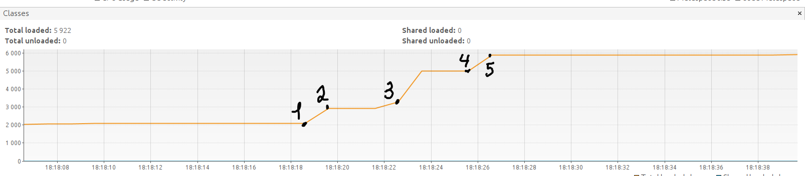
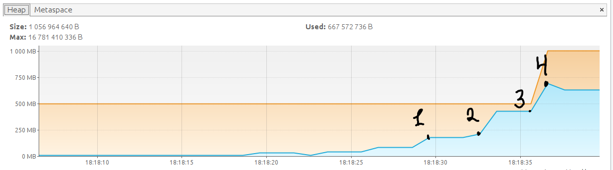

### Задача "Исследование JVM через VisualVM"

#### График Classes

1. выполнение метода````loadToMetaspaceAllFrom("io.vertx");````
начало загрузки классов пакета io.vertx 
2. конец выполнения метода ````loadToMetaspaceAllFrom("io.vertx");```` загружено 529 классов
3. выполнение метода````loadToMetaspaceAllFrom("io.netty");````
начало загрузки классов пакета io.netty, 
конец выполнения метода ````loadToMetaspaceAllFrom("io.netty");```` через
688610 мс, загружено 2117 классов
4. выполнение метода````loadToMetaspaceAllFrom("org.springframework");````
начало загрузки классов пакета org.springframework
5. конец выполнения метода ````loadToMetaspaceAllFrom("org.springframework");````
загружено 869 классов
#### График Metaspaces


#### График Heap


Для обоих графиков:
1. ```` List< List<SimpleObject> simpleObjects = createSimpleObjects(5_000_000);````
начало выполнения метода по созданию списка из 5 миллионов объектов типа SimpleObject, спустя 322842 мс 
конец выполнения  метода createSimpleObjects().
2. ````simpleObjects.addAll(createSimpleObjects(5_000_000));```` строка кода №26 описывает добавление в список simpleObjects
ещё 5 миллионов объектов, в параметрах addAll() происходит вызов метода createSimpleObjects(), спустя 364042 мс метод завершает работу
3. ````simpleObjects.addAll(createSimpleObjects(5_000_000));```` строка кода №28 описывает добавление в список simpleObjects
ещё 5 миллионов объектов, в параметрах addAll() происходит вызов метода createSimpleObjects()
4. метод createSimpleObjects() заверашет работу.

